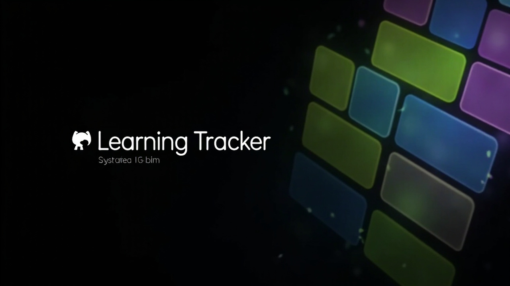

<p align="center">
  
</p>

<h1 align="center">Learning Tracker · 学习追踪器</h1>

<p align="center">
  <strong>个人学习进度追踪应用 / Personal Learning Progress Tracker</strong>
</p>

<p align="center">
  <a href="#features--功能特性">功能</a>
  ·
  <a href="#screenshots--界面截图">界面</a>
  ·
  <a href="#tech-stack--技术栈">技术栈</a>
  ·
  <a href="#usage--使用方法">使用</a>
  ·
  <a href="#project-structure--项目结构">结构</a>
  ·
  <a href="#development--开发">开发</a>
</p>

<p align="center">
  
  
  
  
  
</p>

---

## ✨ Features · 功能特性

| Emoji | 中文 | English |
|:---:|---|---|
| 📅 | **日历视图** — 月历展示每日学习计划和完成情况，支持添加每日计划 | **Calendar View** — Monthly calendar showing daily study plans and completion, supports adding daily plans |
| 🔲 | **60 格进度网格** — 每个任务 5×12 网格，30 个目标 + 30 个超额，一键 +1/+5/+10 | **60-Cell Progress Grid** — 5×12 grid per task, 30 target + 30 bonus cells, quick-add +1/+5/+10 |
| 📊 | **活动热力图** — 13 周 GitHub 风格热力图，直观展示学习活跃度 | **Activity Heatmap** — 13-week GitHub-style heatmap for visualizing learning activity |
| 🔥 | **Streak 统计** — 连续打卡天数、今日完成数、累计完成数 | **Streak Stats** — Consecutive day streaks, today's completions, lifetime totals |
| ☁️ | **Supabase 云同步** — 多设备数据实时同步 | **Supabase Cloud Sync** — Real-time cross-device data synchronization |
| 📴 | **PWA 离线支持** — Service Worker 离线壳，无网络也能查看数据 | **PWA Offline Support** — Service Worker offline shell, accessible without network |
| 🌗 | **深色/浅色主题** — 自动跟随系统或手动切换 | **Dark/Light Theme** — Auto-follow system or manual toggle |

---

## 📱 Screenshots · 界面截图

> **iOS 风格设计系统** / iOS-style design system — 扁平化卡片、柔和配色、系统字体
> Flat cards, muted palette, system fonts

<p align="center">
  <em>日历视图 · Calendar</em> &nbsp;&nbsp;|&nbsp;&nbsp; <em>进度网格 · Grid</em> &nbsp;&nbsp;|&nbsp;&nbsp; <em>统计面板 · Stats</em>
</p>

---

## 🛠 Tech Stack · 技术栈

| 层级 / Layer | 技术 / Technology | 说明 / Description |
|---|---|---|
| **前端 / Frontend** | HTML + CSS + JS (单文件) | Single-file SPA, no framework dependency |
| **PWA** | Manifest + Service Worker | Installable, offline-first shell |
| **后端 / Backend** | Supabase (REST API) | Cloud storage + cross-device sync |
| **设计 / Design** | iOS System Grouped | 仿 iOS 设置页风格 / iOS Settings-style |
| **主题 / Theme** | Auto / Light / Dark | 系统跟随 / System-following |

---

## 🚀 Usage · 使用方法

### 本地运行 / Run Locally

```bash
# 克隆仓库 / Clone the repo
git clone https://github.com/raylanlin/learning-tracker-pwa.git
cd learning-tracker-pwa

# 直接用浏览器打开 index.html，或使用任意静态服务器
# Open index.html in a browser, or use any static server
npx serve .
```

### 部署 / Deploy

本项目可部署到任意静态托管平台 / Deployable to any static hosting:

| 平台 / Platform | 方式 / Method |
|---|---|
| **GitHub Pages** | Settings → Pages → Source: main branch |
| **Netlify** | 拖拽文件夹或 `netlify deploy --prod --dir=.` |
| **Vercel** | 连接仓库自动部署 / Connect repo for auto-deploy |

### 配置 Supabase / Configure Supabase

在 `index.html` 中替换 Supabase 凭据 / Replace Supabase credentials in `index.html`:

```javascript
const SUPABASE_URL = 'https://YOUR_PROJECT.supabase.co'
const SUPABASE_ANON_KEY = 'YOUR_ANON_KEY'
```

---

## 📂 Project Structure · 项目结构

```
learning-tracker-pwa/
├── index.html              # 主应用（v5）/ Main app (v5) — all HTML + CSS + JS
├── colors_and_type.css     # CSS 变量：颜色、字体、阴影、圆角 / Design tokens
├── manifest.json           # PWA 配置 / PWA manifest
├── sw.js                   # Service Worker / 离线壳 / Offline shell
├── SKILL.md                # Claude Code 技能清单 / Skill manifest
├── assets/                 # 图标和横幅 / Icons & banner
│   ├── banner.png          # GitHub README 横幅 / README banner
│   └── icon-512.svg        # PWA 安装图标 / PWA install icon
├── preview/                # 静态预览页面 / Static preview pages
├── release/                # 发布版本 / Release builds
├── source/                 # 源代码 / Source files
├── ui_kits/pwa/            # v4 React 复刻版 / v4 React recreation
├── icon-192.png            # PWA 192px 图标
├── icon-512.png            # PWA 512px 图标
├── apple-touch-icon.png    # iOS 主屏幕图标
└── README.md               # 本文件 / This file
```

---

## 💡 Design System · 设计系统

本项目采用 **iOS 16 风格设计语言**，核心原则：

This project uses an **iOS 16-era design language**, with core principles:

| 原则 / Principle | 中文 | English |
|---|---|---|
| **配色 / Colors** | 语义化强调色，非装饰性 | Semantic accent colors, not decorative |
| **字体 / Typography** | 系统字体栈，无自定义 WebFont | System font stack, no custom webfonts |
| **间距 / Spacing** | 4px 网格，8/12/16/24px 层级 | 4px grid, 8/12/16/24px scale |
| **圆角 / Radii** | 8/12/16/20px 一致层级 | Consistent 8/12/16/20px ladder |
| **动效 / Motion** | 极简，仅模态框有弹性缓动 | Minimal, only modal has spring easing |
| **暗色模式 / Dark Mode** | 完整的深色主题支持 | Full dark theme support |

详细设计令牌请参阅 `colors_and_type.css`。  
For detailed design tokens, see `colors_and_type.css`.

---

## 🧑‍💻 Development · 开发

```bash
# 直接编辑 index.html — 所有代码在单文件中
# Edit index.html directly — all code in a single file

# 修改 CSS 变量后刷新浏览器即可看到效果
# After changing CSS variables, refresh browser to see changes
```

### 版本历史 / Version History

| 版本 / Version | 变更 / Changes |
|---|---|
| **v5** | 柔和配色、统计面板、主题切换、离线优先 / Softer palette, stats tab, theme toggle, offline-first |
| **v4** | React 复刻版（已归档）/ React recreation (archived) |
| **v1–v3** | 初始版本 / Initial versions |

---

## 📄 License · 许可证

MIT

---

<p align="center">
  Made with 🪚 by <a href="https://github.com/raylanlin">Raylan LIN</a>
</p>
